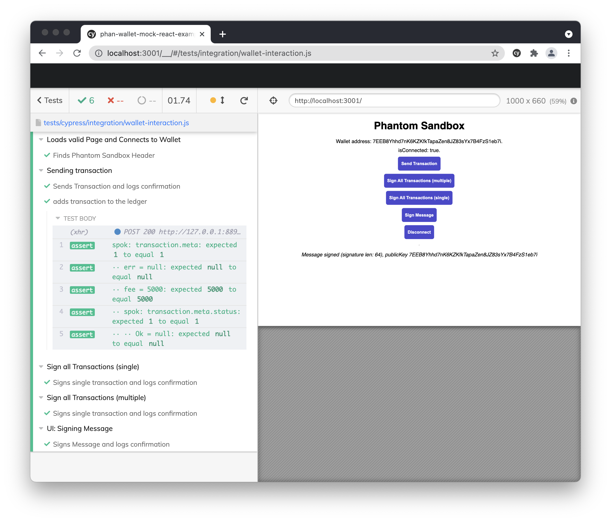

# Phan Wallet Mock App 

Demonstrating how to test applications using the phantom wallet via the
[phan-wallet-mock](https://github.com/thlorenz/phan-wallet-mock) which allows to mock a phantom
wallet which does not require user interaction to sign messages and transactions.

The tested app is adapted from the [phantom wallet
sandbox](https://codesandbox.io/s/github/phantom-labs/sandbox).

## LICENSE

MIT
